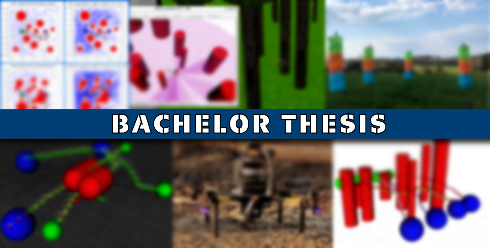
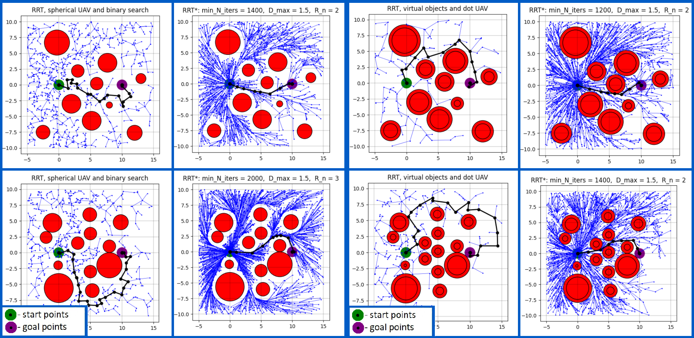
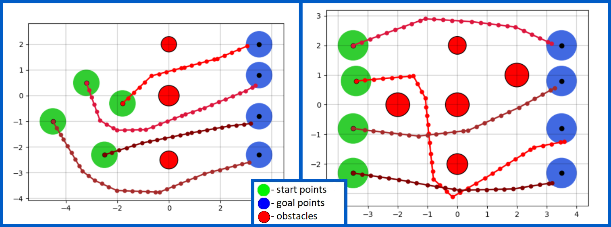

# An Improved RRT* Algorithm for Multi-Robot Path Planning, Bachelor Thesis Project

This repository contains my bachelor thesis project, which I was writing at FEE CTU (FEL ČVUT) in Prague.
The name of my bachelor program is Cybernetics and Robotics :mechanical_arm:. This README provides only a meager view on my whole work,
that is full of details and nuances. That said, I encourage you to take a look at my thesis text, 
located in [a directory](https://github.com/poludmik/Path-planning-for-multiple-UAVs/tree/master/LaTeX_text).

## Abstract

This thesis includes a brief overview of the UAV path planning and a detailed explanation of the algorithms 
implemented in C++. The implementation of the RRT and RRT* algorithms were carried out and extended to handle 
the generation of trajectories for multiple drones. Two obstacle avoidance approaches were introduced and tested 
with both RRT family path-planning algorithms. Experiments of autonomous UAV flight in a forest-like environment 
were conducted in both simulation and real life; for this purpose, detection and mapping of trees using an active 
lidar sensor was implemented.

## Path planning algorithms

Repository contains two basic algorithms for path planning in 3D: RRT and RRT*. Parameters of both algorithms were
thoroughly explored and compared. Examples of path finding in 2D:

These algorithms were expanded to consider trajectory planning for multiple agents, 2D example:

## Obstacle avoidance

To perform obstacle avoidance, the collision detection module was written. For simplicity, two object forms were introduced:
spheres and cylinders. However, with small additions, the above path planning would work with more complex objects, 
i.e. 3D polygon meshes.

## Autonomous flight :flying_saucer:

It was decided to conduct an autonomous flight experiment to proof the usability and robustness of implemented algorithms.
Firstly in simulations and then with a real drone. For a drone to fly through an environment with obstacles, the obstacle
detection module is needed. I used a 3D lidar sensor to detect and map the environment around the drone.
Videos of both simulation and real life tests are available on 
[my YouTube channel](https://www.youtube.com/channel/UCl_x6sfatAq_x5uvAaIRJug/featured).

  

> A few words about licensing. This is a CTU thesis, so here are the rules CTU provides:\
> "A university thesis is a work protected by the Copyright Act. Extracts, copies and transcripts of the thesis 
> are allowed for personal use only and at one?s own expense. The use of thesis should be in compliance with 
> the Copyright Act http://www.mkcr.cz/assets/autorske-pravo/01-3982006.pdf and the citation ethics 
> http://knihovny.cvut.cz/vychova/vskp.html"

